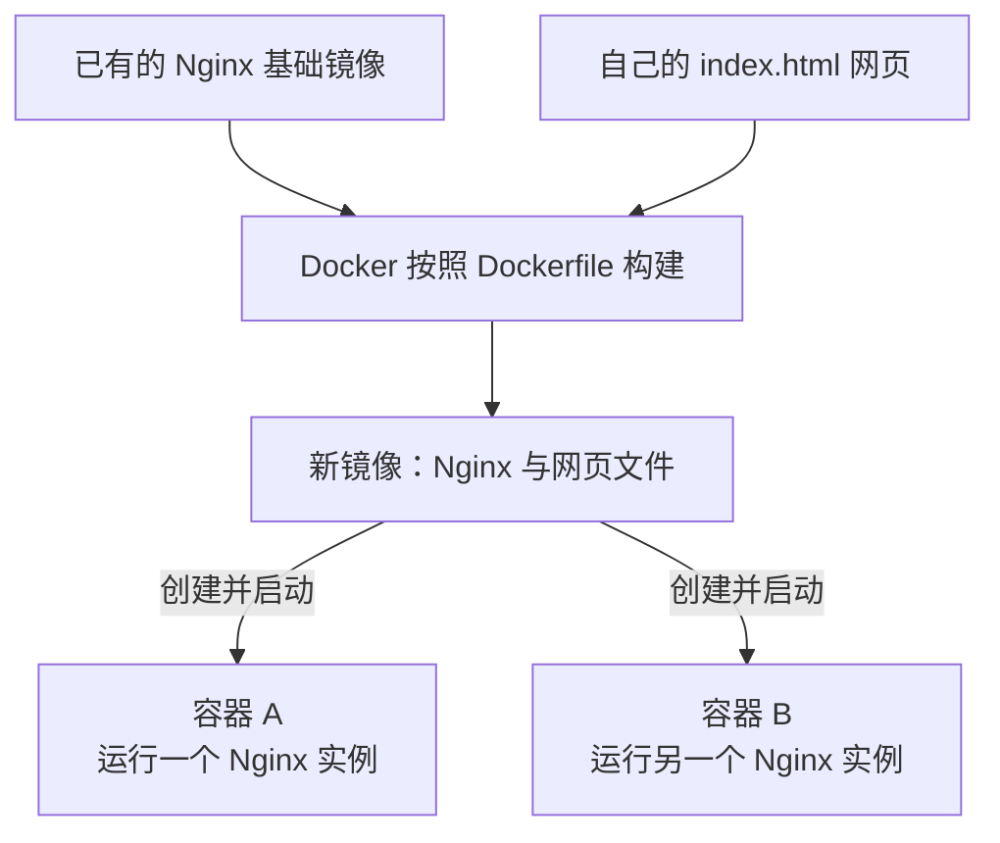

# 用镜像创建容器

从 Nginx 基础镜像和网页文件构建新镜像，再创建两个容器。两个容器使用相同的初始文件，各自运行应用。

```mermaid
flowchart TD
    base["已有的 Nginx 基础镜像"] --> build["Docker 按照 Dockerfile 构建"]
    page["自己的 index.html 网页"] --> build
    build --> image["新镜像：Nginx 与网页文件"]
    image -->|"创建并启动"| first["容器 A<br/>运行一个 Nginx 实例"]
    image -->|"创建并启动"| second["容器 B<br/>运行另一个 Nginx 实例"]
```
