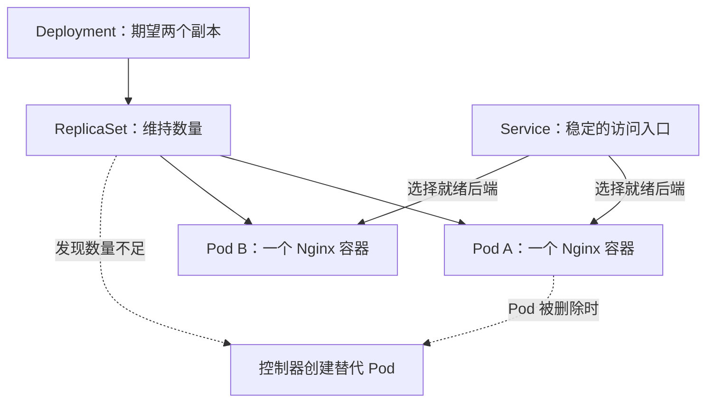

# 副本管理与服务入口

Deployment 和 ReplicaSet 管理副本，Service 选择可以接收请求的后端。

```mermaid
flowchart TD
    desired["Deployment：期望两个副本"] --> controller["ReplicaSet：维持数量"]
    controller --> podone["Pod A：一个 Nginx 容器"]
    controller --> podtwo["Pod B：一个 Nginx 容器"]
    service["Service：稳定的访问入口"] -->|"选择就绪后端"| podone
    service -->|"选择就绪后端"| podtwo
    podone -.->|"Pod 被删除时"| replacement["控制器创建替代 Pod"]
    controller -.->|"发现数量不足"| replacement
```
