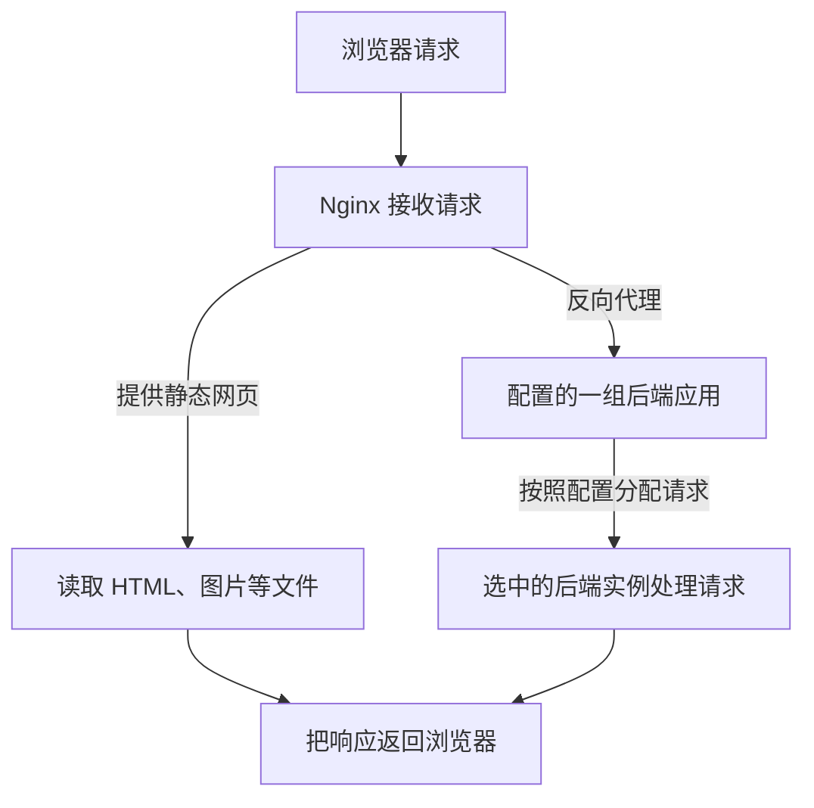

# Nginx 的网页服务与反向代理

静态服务与反向代理对应两种常见请求处理用途。

```mermaid
flowchart TD
    client["浏览器请求"] --> nginx["Nginx 接收请求"]
    nginx -->|"提供静态网页"| files["读取 HTML、图片等文件"]
    nginx -->|"反向代理"| backend["配置的一组后端应用"]
    backend -->|"按照配置分配请求"| replicas["选中的后端实例处理请求"]
    files --> result["把响应返回浏览器"]
    replicas --> result
```
