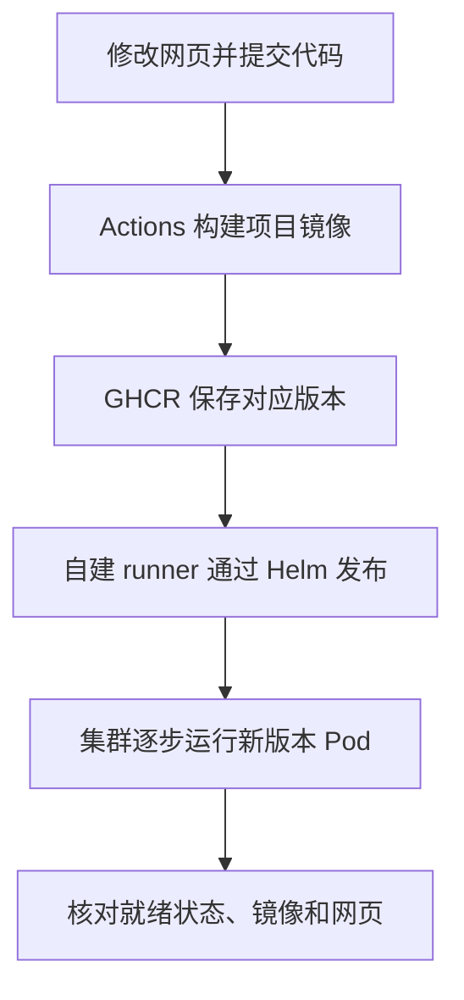

# 从提交代码到访问新版本

沿构建产物、部署和网页验证三个环节追踪版本。

```mermaid
flowchart TD
    code["修改网页并提交代码"] --> build["Actions 构建项目镜像"]
    build --> registry["GHCR 保存对应版本"]
    registry --> deploy["自建 runner 通过 Helm 发布"]
    deploy --> pods["集群逐步运行新版本 Pod"]
    pods --> check["核对就绪状态、镜像和网页"]
```
