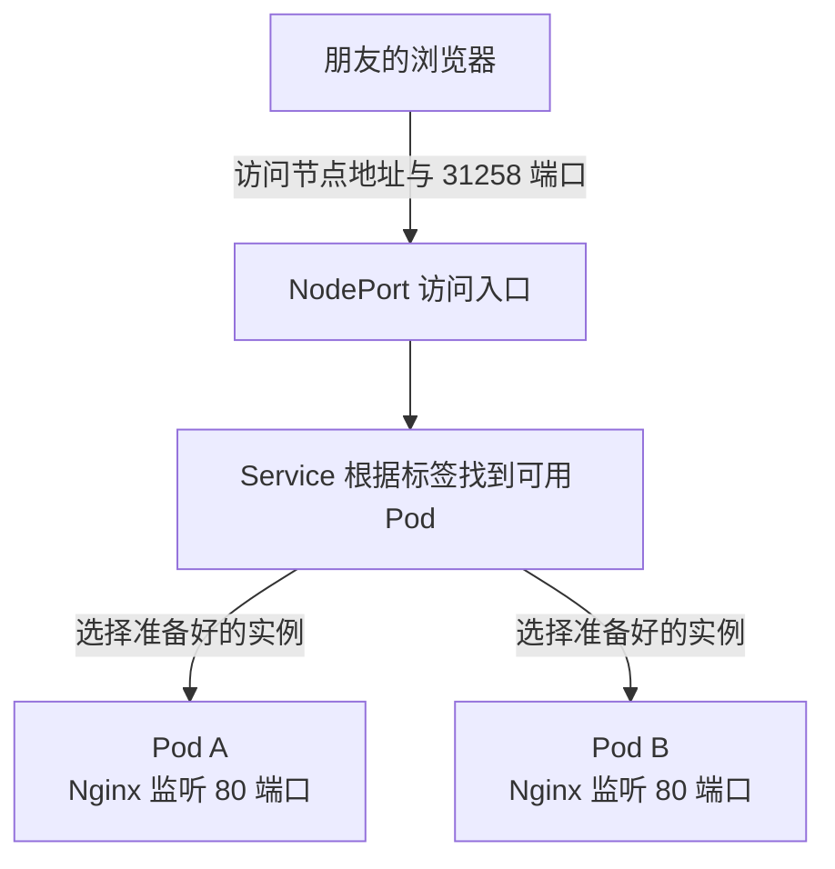

# 从外部入口访问 Nginx

项目基础部署通过节点的 31258 端口进入 NodePort 类型的 Service，再由网络规则将请求送到符合条件的 Pod 的 80 端口。图中两个分支表示可以选择的实例。

```mermaid
flowchart TD
    browser["朋友的浏览器"] -->|"访问节点地址与 31258 端口"| entry["NodePort 访问入口"]
    entry --> service["Service 根据标签找到可用 Pod"]
    service -->|"选择准备好的实例"| first["Pod A<br/>Nginx 监听 80 端口"]
    service -->|"选择准备好的实例"| second["Pod B<br/>Nginx 监听 80 端口"]
```
