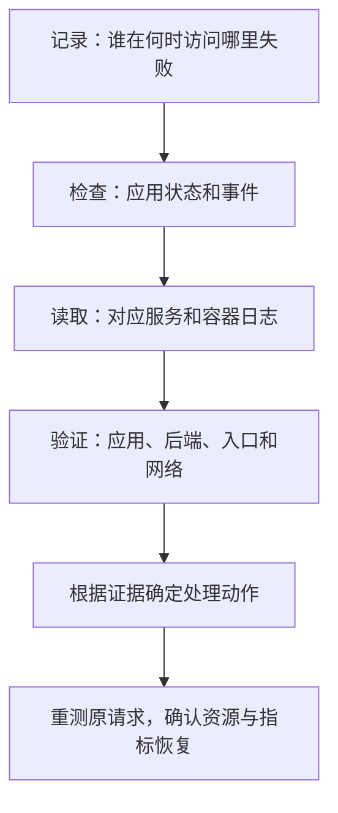

# 故障排查顺序

每一步检查应帮助确定原因，最后重新验证原来失败的请求。

```mermaid
flowchart TD
    problem["记录：谁在何时访问哪里失败"] --> state["检查：应用状态和事件"]
    state --> logs["读取：对应服务和容器日志"]
    logs --> scope["验证：应用、后端、入口和网络"]
    scope --> cause["根据证据确定处理动作"]
    cause --> verify["重测原请求，确认资源与指标恢复"]
```
