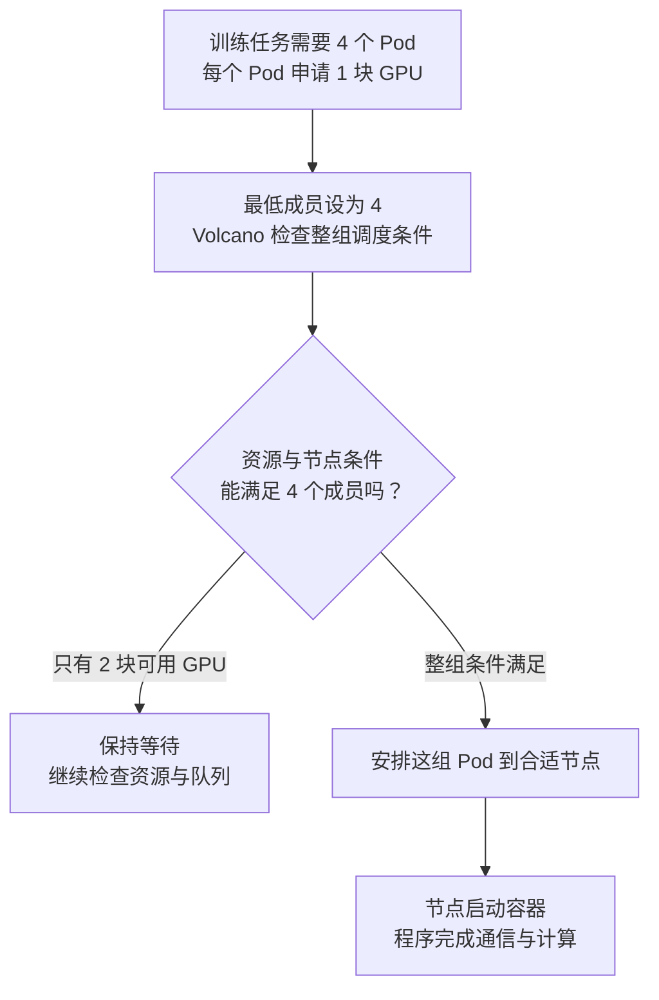

# 四成员训练的成组调度

这是四个成员全部必需、每个成员申请一块 GPU 的讲解例子。成组条件还需要同时满足 CPU、内存和节点要求。调度完成后，启动与成员通信由节点和程序继续完成。

```mermaid
flowchart TD
    job["训练任务需要 4 个 Pod<br/>每个 Pod 申请 1 块 GPU"] --> group["最低成员设为 4<br/>Volcano 检查整组调度条件"]
    group --> enough{"资源与节点条件<br/>能满足 4 个成员吗？"}
    enough -->|"只有 2 块可用 GPU"| wait["保持等待<br/>继续检查资源与队列"]
    enough -->|"整组条件满足"| assign["安排这组 Pod 到合适节点"]
    assign --> start["节点启动容器<br/>程序完成通信与计算"]
```
