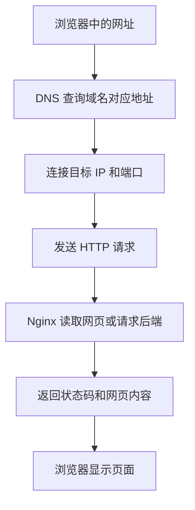

# 浏览器访问网页

使用域名时先查询地址，再建立通信并交换 HTTP 请求与响应。

```mermaid
flowchart TD
    browser["浏览器中的网址"] --> dns["DNS 查询域名对应地址"]
    dns --> connection["连接目标 IP 和端口"]
    connection --> http["发送 HTTP 请求"]
    http --> nginx["Nginx 读取网页或请求后端"]
    nginx --> response["返回状态码和网页内容"]
    response --> display["浏览器显示页面"]
```
